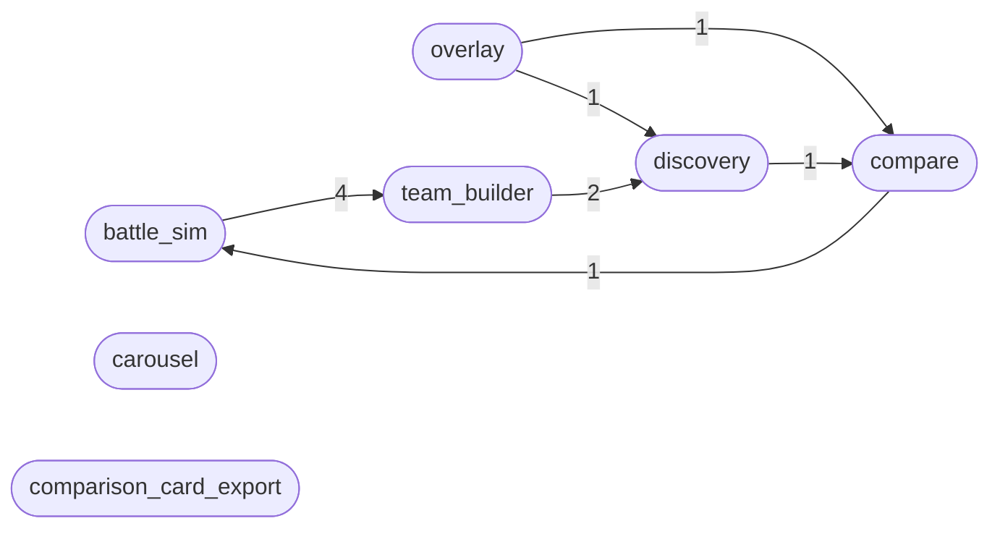

# Feature graph

```mermaid
graph LR
    battle_sim(["battle_sim"])
    carousel(["carousel"])
    compare(["compare"])
    comparison_card_export(["comparison_card_export"])
    discovery(["discovery"])
    overlay(["overlay"])
    team_builder(["team_builder"])
    battle_sim -- 4 --> team_builder
    compare -- 1 --> battle_sim
    discovery -- 1 --> compare
    overlay -- 1 --> compare
    overlay -- 1 --> discovery
    team_builder -- 2 --> discovery
```
